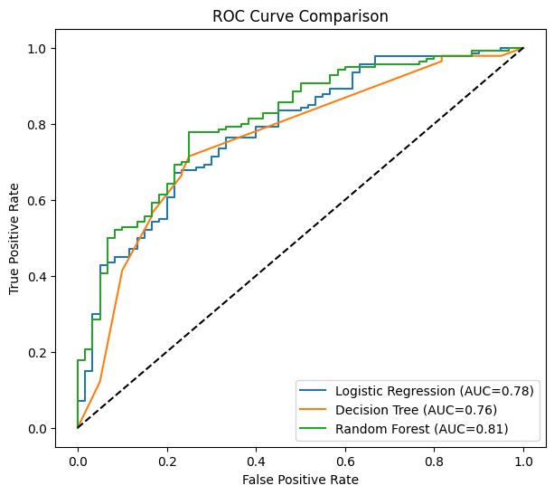
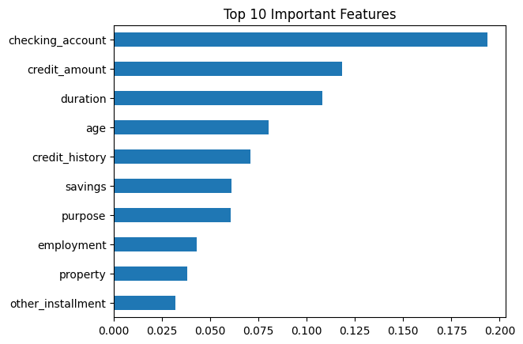

# CodeAlpha_CreditScoringModel

## 📌 Task 1: Credit Scoring Model
**Internship:** CodeAlpha — Machine Learning
**Objective:** Predict an individual's creditworthiness (good/bad credit risk) using past financial data.

## 📂 Dataset
**German Credit Data** (UCI Statlog Dataset)
- 1000 records, 21 columns (20 features + target)
- Target: `1` = Good Credit, `0` = Bad Credit
- Features include: checking account status, credit duration, credit history, purpose, credit amount, savings, employment, age, and more.

## ⚙️ Approach
1. **Data Loading** — Loaded and labeled the UCI German Credit dataset.
2. **Preprocessing** — Encoded categorical features, split into train/test sets (80/20), and scaled numeric features.
3. **Model Training** — Trained three classification models:
   - Logistic Regression
   - Decision Tree
   - Random Forest
4. **Evaluation** — Assessed each model using Accuracy, Precision, Recall, F1-Score, and ROC-AUC.
5. **Visualization** — Generated an ROC curve comparison and a feature importance chart.

## 🗂 Project Structure
```
CodeAlpha_CreditScoringModel/
├── data_loader.py       # Loads and labels the dataset
├── preprocess.py        # Encoding, train/test split, scaling
├── train_models.py      # Trains Logistic Regression, Decision Tree, Random Forest
├── evaluate.py          # Metrics + ROC/feature importance plots
├── main.py               # Runs the full pipeline end to end
├── requirements.txt      # Python dependencies
├── outputs/
│   ├── roc_curve.png
│   └── feature_importance.png
└── README.md
```

## ▶️ How to Run
```bash
pip install -r requirements.txt
python main.py
```

## 📊 Results

| Model               | Accuracy | Precision | Recall | F1-Score | ROC-AUC |
|---------------------|----------|-----------|--------|----------|---------|
| Logistic Regression | 0.740    | 0.801     | 0.836  | 0.818    | 0.782   |
| Decision Tree       | 0.725    | 0.870     | 0.714  | 0.784    | 0.757   |
| Random Forest       | 0.780    | 0.782     | 0.950  | 0.858    | 0.808   |

**Best performing model:** Random Forest — highest Accuracy, Recall, F1-Score, and ROC-AUC (0.81), making it the most reliable at correctly identifying good credit risks while limiting missed cases.

### ROC Curve Comparison


### Top 10 Important Features (Random Forest)


The most influential features were **checking account status**, **credit amount**, and **loan duration** — all directly tied to an applicant's existing financial standing and repayment burden.

## 🛠 Tech Stack
- Python
- pandas, numpy
- scikit-learn
- matplotlib, seaborn

## 👤 Author
CodeAlpha Machine Learning Internship — Task 1